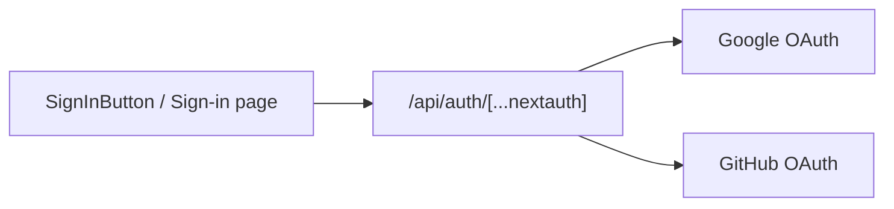

# Frontend architecture

## Design principles

- **Modular sections** — Each landing block is a self-contained component under `components/landing/`.
- **Server vs client** — Page shell and `LandingPage` composition stay server-friendly; interactive pieces (`"use client"`) are isolated.
- **Single auth source** — `authOptions` in `lib/auth.ts` is imported only by the API route to avoid config drift.

## Hero globe (WebGL)

The hero background uses **React Three Fiber**:

```
GlobeScene (Canvas wrapper)
  └── GlobeMesh (geometry + animation)
        ├── Translucent sphere (meshPhysicalMaterial)
        ├── Lat/long grid (line segments, slate cyan)
        ├── Surface nodes (points, data-path metaphor)
        └── Outer glow shell (back-side sphere)
```

Rotation runs in `useFrame` at ~0.04 rad/s — slow enough to feel ambient, not distracting.

`GlobeScene` is a client component; the canvas is `pointer-events-none` so it never blocks UI clicks.

## Styling system

Dark theme tokens live in `globals.css` (`--background`, `--accent`, etc.). Tailwind utility classes use slate/cyan palette:

- Background: `slate-950`
- Accent: `cyan-400` / `cyan-500`
- Cards: `slate-900/40` with `border-slate-800`

## Auth integration



JWT sessions avoid a database for the marketing site; extend with adapters when adding a dashboard.

## Extension points

| Goal              | Where to extend                          |
| ----------------- | ---------------------------------------- |
| Dashboard routes  | `src/app/(dashboard)/`                   |
| API client        | `src/lib/api.ts`                         |
| More providers    | `src/lib/auth.ts` providers array        |
| CMS / blog        | New route group under `app/`             |
| Analytics         | Root `layout.tsx` or section components  |
